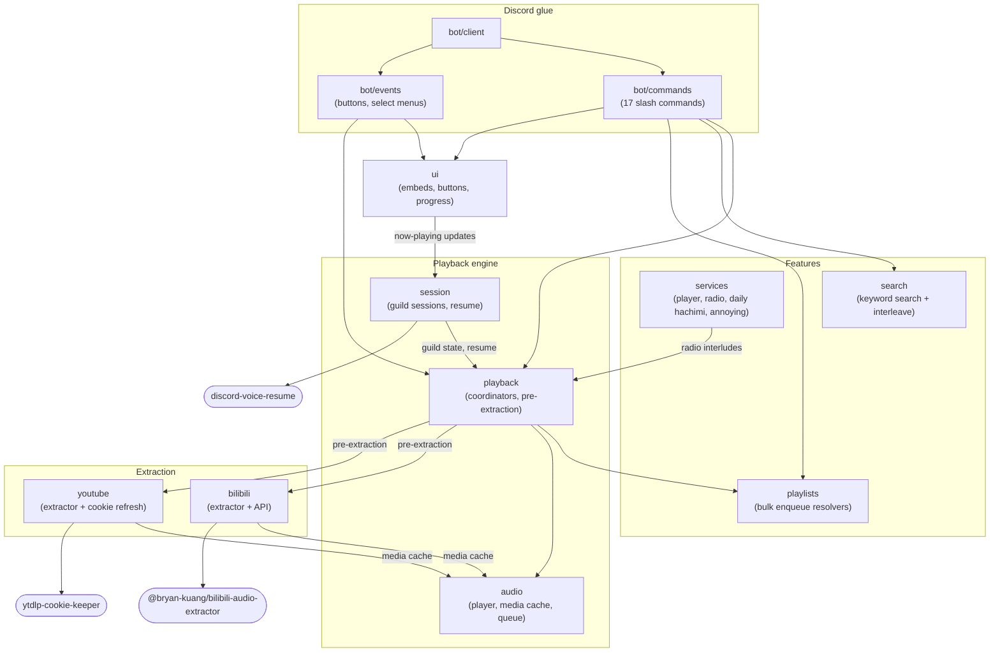
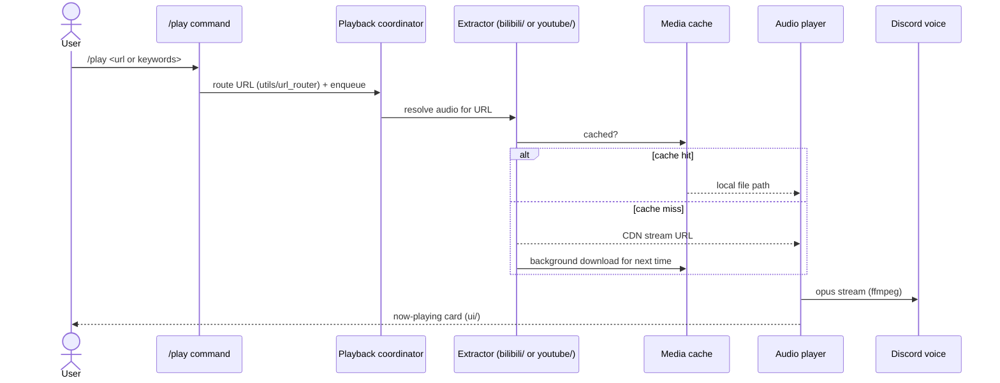
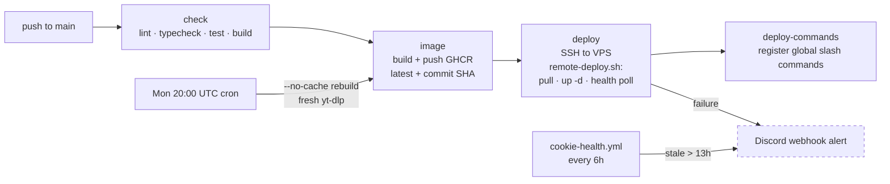

# Architecture

Visual map of F.M. Hachimi. For operations (deploying, cookies, incidents) see
[`OPERATIONS.md`](../OPERATIONS.md); for the testing-command system see
[`testing-features.md`](testing-features.md).

## Module map

One node per `src/` directory. Arrows point in the direction of calls.

Cross-cutting (used everywhere, omitted from the graph): `config/` (env-validated
settings), `utils/` (formatters, locks, URL routing), `observability/` (metrics +
`/healthz` server on `127.0.0.1:9090`), `models/` + `types.ts` (shared types),
`services/logger_service` (winston).

## Playback data flow

The cache is two independent LRU stores (`cache/bilibili/`, `cache/youtube/`),
each capped by entry count and total bytes with its own `index.json`
(`src/audio/media_cache.ts`; caps in `src/config/config.ts`).

## Deploy pipeline

- PRs run `check` + `image` (build only, no push/deploy).
- The VPS pulls the **exact SHA-tagged image CI tested** — it never rebuilds.
- Full runbook: [`OPERATIONS.md`](../OPERATIONS.md).

## Directory guide

| Directory | Responsibility |
|---|---|
| `src/bot/commands/` | Slash command definitions (one file per command; registry in `index.ts`) |
| `src/bot/events/` | Interaction routing: buttons, select menus |
| `src/bot/client.ts` | Discord client wiring |
| `src/services/` | Feature services: player facade, radio rotation, daily hachimi cron, annoying mode, logger |
| `src/session/` | Per-guild voice session state, audio manager, resume-after-deploy |
| `src/playback/` | Coordinators between session and audio: playlist flow, pre-extraction |
| `src/audio/` | Playback engine: ffmpeg/opus player, media cache (LRU), queue, CDN retry |
| `src/bilibili/` | Bilibili metadata + audio extraction (adapter over `@bryan-kuang/bilibili-audio-extractor`) |
| `src/youtube/` | YouTube extraction via yt-dlp + cookie refresh (adapter over `ytdlp-cookie-keeper`) |
| `src/search/` | Keyword search across platforms, result interleaving, session store |
| `src/playlists/` | Playlist URL resolvers for bulk enqueue |
| `src/ui/` | Embeds, button rows, progress bars, search result views |
| `src/config/` | Env parsing + validation, all tunables |
| `src/observability/` | Metrics registry + loopback HTTP server (`/healthz`, `/metrics`) |
| `src/utils/` | Small shared helpers (formatting, locks, URL routing, history) |
| `src/models/`, `src/types.ts` | Shared domain types |

**Test convention:** all tests live under `tests/` (`unit/`, `regression/`,
`integration/`). `regression/` captures incident-driven cases — add one whenever a
production bug is fixed. Write new tests in TypeScript; existing `.js` tests are
converted only when touched.
