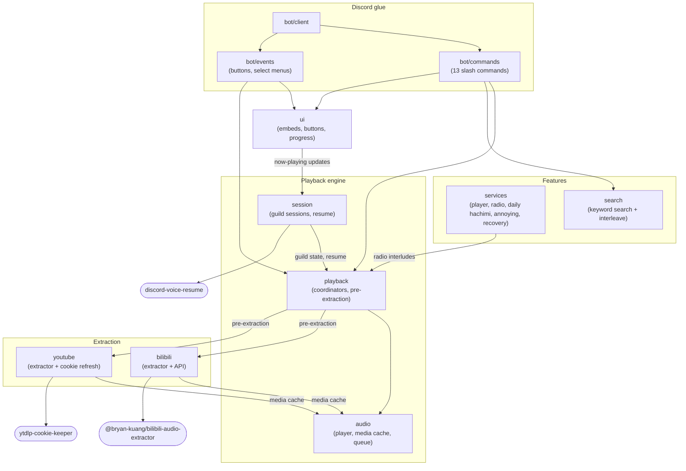
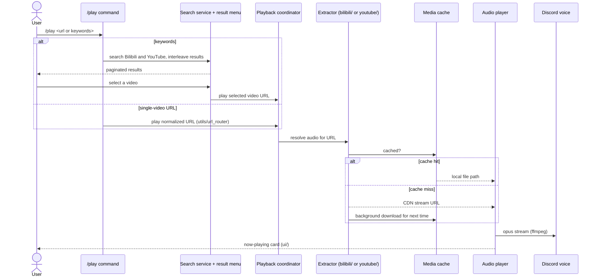
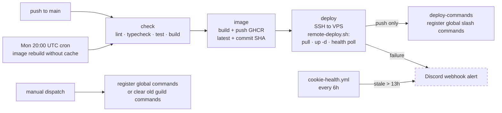

# Architecture

Visual map of F.M. Hachimi. For operations (deploying, cookies, incidents) see
[`OPERATIONS.md`](../OPERATIONS.md). Commands register globally; automated
regression tests cover the retained playback and recovery paths.

## Module map

Main `src/` components. Arrows point in the direction of calls.

```mermaid
graph TD
    subgraph Discord glue
        commands["bot/commands<br/>(13 slash commands)"]
        events["bot/events<br/>(buttons, select menus)"]
        client["bot/client"]
    end

    subgraph Features
        services["services<br/>(player, radio, daily hachimi, annoying, recovery)"]
        search["search<br/>(keyword search + interleave)"]
    end

    subgraph Playback engine
        session["session<br/>(guild sessions, resume)"]
        playback["playback<br/>(coordinators, pre-extraction)"]
        audio["audio<br/>(player, media cache, queue)"]
    end

    subgraph Extraction
        bilibili["bilibili<br/>(extractor + API)"]
        youtube["youtube<br/>(extractor + cookie refresh)"]
    end

    ui["ui<br/>(embeds, buttons, progress)"]

    pkg1(["@bryan-kuang/bilibili-audio-extractor"])
    pkg2(["ytdlp-cookie-keeper"])
    pkg3(["discord-voice-resume"])

    client --> commands
    client --> events
    commands --> playback
    commands --> search
    commands --> ui
    events --> ui
    events --> playback

    services -->|radio interludes| playback
    session -->|guild state, resume| playback
    ui -->|now-playing updates| session

    playback --> audio
    playback -->|pre-extraction| bilibili
    playback -->|pre-extraction| youtube

    bilibili -->|media cache| audio
    youtube -->|media cache| audio

    bilibili --> pkg1
    youtube --> pkg2
    session --> pkg3
```

Cross-cutting (used everywhere, omitted from the graph): `config/` (env-validated
settings), `utils/` (formatters, locks, URL routing), `observability/` (metrics +
`/healthz`, `/readyz`, `/metrics`; host binding `127.0.0.1:9090`), `models/` + `types.ts` (shared types),
`services/logger_service` (winston).

## Playback data flow

```mermaid
sequenceDiagram
    actor U as User
    participant C as /play command
    participant S as Search service + result menu
    participant P as Playback coordinator
    participant X as Extractor (bilibili/ or youtube/)
    participant M as Media cache
    participant A as Audio player
    participant D as Discord voice

    U->>C: /play <url or keywords>
    alt keywords
        C->>S: search Bilibili and YouTube, interleave results
        S-->>U: paginated results
        U->>S: select a video
        S->>P: play selected video URL
    else single-video URL
        C->>P: play normalized URL (utils/url_router)
    end
    P->>X: resolve audio for URL
    X->>M: cached?
    alt cache hit
        M-->>A: local file path
    else cache miss
        X-->>A: CDN stream URL
        X->>M: background download for next time
    end
    A->>D: opus stream (ffmpeg)
    A-->>U: now-playing card (ui/)
```

`/play` has only one required parameter, `query`. A Bilibili part link keeps
its explicit part; a YouTube watch link with a playlist parameter plays only
the selected video. Bulk imports and attachments are unsupported.

Normal playback adds the selected video to the queue. During radio, `/play`
and daily-recommendation clicks interject immediately via `RadioService.playNow`,
then rotation resumes. Radio prefetches the next track and inserts a mandatory
break after the interval elapses and the current song ends naturally. Playback
requests and skipping are refused during the break.

The cache is two independent LRU stores (`cache/bilibili/`, `cache/youtube/`),
each capped by entry count and total bytes with its own `index.json`
(`src/audio/media_cache.ts`; caps in `src/config/config.ts`).

## Deploy pipeline

```mermaid
flowchart LR
    push["push to main"] --> check["check<br/>lint · typecheck · test · build"]
    check --> image["image<br/>build + push GHCR<br/>latest + commit SHA"]
    image --> deploy["deploy<br/>SSH to VPS<br/>remote-deploy.sh:<br/>pull · up -d · health poll"]
    deploy -->|push only| cmds["deploy-commands<br/>register global slash commands"]

    cron["Mon 20:00 UTC cron<br/>image rebuild without cache"] --> check
    manual["manual dispatch"] --> commandOnly["register global commands<br/>or clear old guild commands"]
    cookie["cookie-health.yml<br/>every 6h"] -->|stale > 13h| hook
    deploy -->|failure| hook["Discord webhook alert"]

    style hook stroke-dasharray: 5 5
```

- PRs run `check` + `image` (build only, no push/deploy).
- The VPS pulls the **exact SHA-tagged image CI tested** — it never rebuilds.
- Full runbook: [`OPERATIONS.md`](../OPERATIONS.md).

## Recovery and runtime state

The Compose stack contains the bot plus the YouTube PO-token sidecar on `botnet`.
Host mounts preserve `data/`, `secrets/` and both `cache/` stores; the dedicated
Chrome profile is mounted read-only for cookie export.

`ResumeService` snapshots playback and idle voice presence periodically and on
shutdown. `VoiceRecoveryService` (`src/services/voice_recovery_service.ts`) verifies intended membership against Discord,
serializes per-guild reconstruction, retries transient failures and cancels stale
work after user actions. Annoying mode applies audit-log exemptions before
requesting recovery; its armed flags persist independently of resume snapshots.

`/healthz` reports process liveness. `/readyz` reports gateway and voice readiness;
Docker uses this endpoint. `/metrics` returns JSON counters and gauges. The gateway
watchdog handles prolonged gateway outages, while voice recovery works per guild.
Existing error webhooks report runtime failures. Cloud repair tooling is outside
this repository's current scope.

## Directory guide

| Directory | Responsibility |
|---|---|
| `src/bot/commands/` | Slash command definitions (one file per command; registry in `index.ts`) |
| `src/bot/events/` | Interaction routing: buttons, select menus |
| `src/bot/client.ts` | Discord client wiring |
| `src/services/` | Feature services: player facade, radio rotation, daily hachimi cron, annoying mode, voice recovery, logger |
| `src/session/` | Per-guild voice state, audio manager and resume |
| `src/playback/` | Coordinators between session and audio: single-video playback, pre-extraction |
| `src/audio/` | Playback engine: ffmpeg/opus player, media cache (LRU), queue, CDN retry |
| `src/bilibili/` | Bilibili metadata + audio extraction (adapter over `@bryan-kuang/bilibili-audio-extractor`) |
| `src/youtube/` | YouTube extraction via yt-dlp + cookie refresh (adapter over `ytdlp-cookie-keeper`) |
| `src/search/` | Keyword search across platforms, result interleaving, session store |
| `src/ui/` | Embeds, button rows, progress bars, search result views |
| `src/config/` | Env parsing + validation, all tunables |
| `src/observability/` | Metrics registry + health HTTP server (`/healthz`, `/readyz`, `/metrics`) |
| `src/utils/` | Small shared helpers (formatting, locks, URL routing, history) |
| `src/models/`, `src/types.ts` | Shared domain types |

**Test convention:** all tests live under `tests/` (`unit/`, `regression/`,
`integration/`). `regression/` captures incident-driven cases — add one whenever a
production bug is fixed. Write new tests in TypeScript; existing `.js` tests are
converted only when touched.
